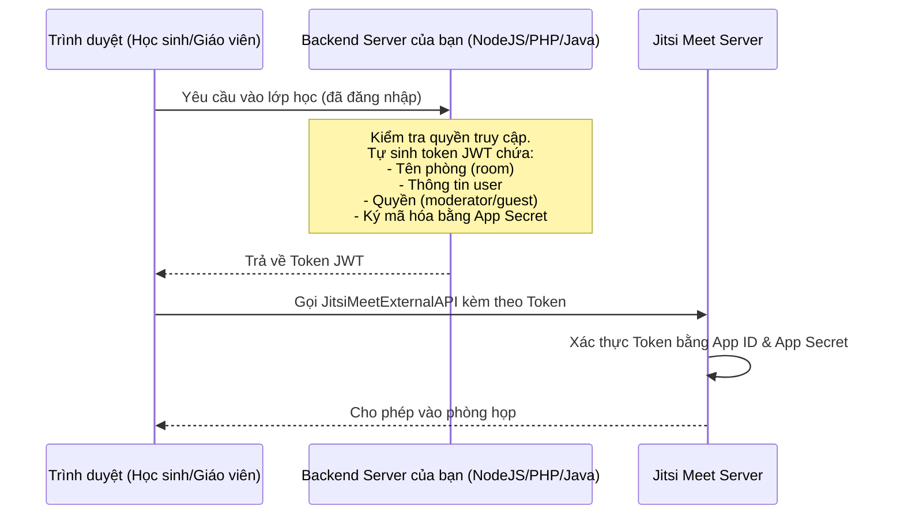

# Hướng Dẫn Tích Hợp Jitsi Meet Vào Website (LMS / E-Learning)

Thông thường, đối với các hệ thống học trực tuyến hoặc quản lý lớp học, người ta không dùng trực tiếp giao diện độc lập của Jitsi mà nhúng nó làm một thành phần (iframe/component) trong trang web của họ.

Cách phổ biến nhất là sử dụng **Jitsi Meet External API** (thư viện JavaScript chính thức của Jitsi).

---

## 1. Tích Hợp Bằng Jitsi Meet External API (JavaScript)

External API cho phép nhúng trực tiếp giao diện cuộc họp Jitsi Meet vào một thẻ `div` trong trang web của bạn thông qua iframe và cung cấp các hàm điều khiển (API) bằng JavaScript.

### Bước 1: Nhúng thư viện `external_api.js`
Thư viện này được phân phối trực tiếp từ máy chủ Jitsi Meet của bạn (hoặc máy chủ thử nghiệm `meet.jit.si`).

```html
<script src="https://<YOUR_JITSI_DOMAIN>/external_api.js"></script>
```

### Bước 2: Tạo thẻ chứa giao diện cuộc họp
```html
<div id="meet-container" style="width: 100%; height: 600px;"></div>
```

### Bước 3: Khởi tạo Jitsi Meet bằng JavaScript
```javascript
const domain = "YOUR_JITSI_DOMAIN"; // Ví dụ: localhost:8443 hoặc meet.jit.si
const options = {
    roomName: "LopHocTiengAnh_101",
    width: "100%",
    height: "100%",
    parentNode: document.querySelector('#meet-container'),
    userInfo: {
        email: 'student@example.com',
        displayName: 'Nguyễn Văn A' // Tên hiển thị tự động khi vào phòng
    },
    configOverwrite: {
        startWithAudioMuted: true, // Tự động mute mic khi vào
        startWithVideoMuted: false, // Tự động mở camera khi vào
        prejoinPageEnabled: false,  // Bỏ qua trang xác nhận trước khi vào họp
    },
    interfaceConfigOverwrite: {
        TOOLBAR_BUTTONS: [
            'microphone', 'camera', 'closedcaptions', 'desktop', 'embedmeeting', 'fullscreen',
            'fodeviceselection', 'hangup', 'profile', 'chat', 'recording',
            'livestreaming', 'etherpad', 'sharedvideo', 'settings', 'raisehand',
            'videoquality', 'filmstrip', 'invite', 'feedback', 'stats', 'shortcuts',
            'tileview', 'videobackgroundblur', 'download', 'help', 'mute-everyone',
            'security'
        ],
        SETTINGS_SECTIONS: [ 'devices', 'language', 'profile', 'calendar' ],
    }
};

const api = new JitsiMeetExternalAPI(domain, options);
```

---

## 2. Giao Tiếp Hai Chiều (Events & Commands)

Sau khi nhúng, hệ thống của bạn có thể giao tiếp với Jitsi thông qua hai cơ chế:

### A. Lắng nghe sự kiện từ Jitsi (Events)
Bạn có thể biết khi nào người dùng tham gia, rời phòng, bật/tắt camera để lưu dữ liệu điểm danh, chấm công:

```javascript
// Lắng nghe khi cuộc họp kết thúc (người dùng nhấn nút gác máy)
api.addEventListener('videoConferenceLeft', () => {
    alert("Bạn đã rời khỏi lớp học!");
    // Điều hướng người dùng về trang chủ hoặc trang đánh giá giáo viên
    window.location.href = "/dashboard";
});

// Lắng nghe khi có người dùng khác tham gia phòng
api.addEventListener('participantJoined', (participant) => {
    console.log("Học sinh mới tham gia:", participant.displayName, participant.id);
});
```

### B. Điều khiển Jitsi bằng code của bạn (Commands)
Bạn có thể kích hoạt các hành động từ nút bấm trên giao diện Web của bạn:

```javascript
// Bật/tắt mic bằng một nút riêng trên trang web của bạn
function toggleMute() {
    api.executeCommand('toggleAudio');
}

// Bắt đầu ghi hình cuộc họp
function startRecord() {
    api.executeCommand('startRecording', {
        mode: 'file' // Lưu file ghi hình
    });
}
```

---

## 3. Bảo Mật Phòng Họp Bằng Token (JWT - JSON Web Token)

Trong môi trường thực tế (production), bạn không thể để phòng họp công khai vì bất kỳ ai có link phòng cũng có thể vào phá đám. Jitsi hỗ trợ bảo mật bằng JWT:

### Quy trình hoạt động:


### Cách nhúng khi có Token:
Bạn chỉ cần truyền thêm tham số `jwt` vào phần `options`:

```javascript
const options = {
    roomName: "LopHocTiengAnh_101",
    jwt: "eyJhbGciOiJIUzI1NiIsInR5cCI6IkpXVCJ9...", // Token do server của bạn sinh ra
    parentNode: document.querySelector('#meet-container'),
    // ...
};
```

---

## 4. Các SDK Cho Framework Hiện Đại

* **React SDK**: [`@jitsi/react-sdk`](https://www.npmjs.com/package/@jitsi/react-sdk) - Cung cấp Component `<JitsiMeeting />` để nhúng cực nhanh trong React.
* **React Native SDK**: [`@jitsi/react-native-sdk`](https://www.npmjs.com/package/@jitsi/react-native-sdk) - Dùng khi bạn tự build App Mobile riêng.
